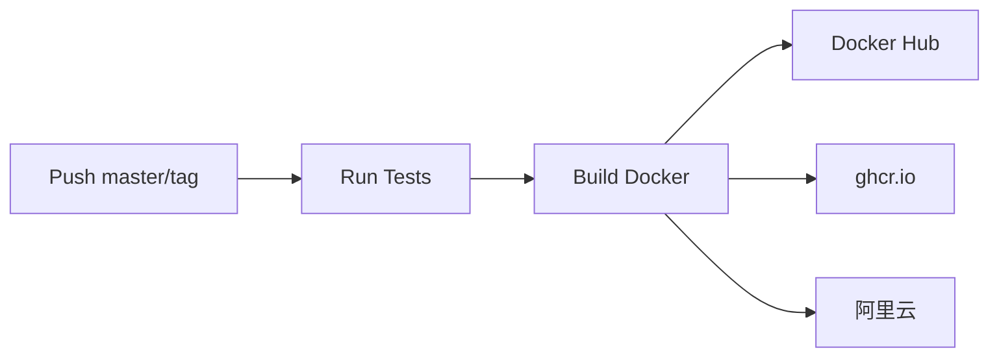

<div align="center">

# 📒 Ledger — 个人记账系统

**收支管理 · 预算规划 · 多维度统计 · Web 界面 · AI Agent 集成**

[](https://github.com/kdeerfish/ledger/actions)
[](https://hub.docker.com/r/zouzhenglu/ledger)
[](https://github.com/kdeerfish/ledger/releases)
[](LICENSE)
[](https://www.python.org/)
[](https://github.com/kdeerfish/ledger/actions)

**[快速开始](#-快速开始) · [CLI 命令](#-cli-命令速查) · [Web 界面](#-web-管理界面) · [Docker 部署](#-docker-部署) · [API 文档](docs/api.md) · [开发指南](docs/development.md)**

---

[🇨🇳 中文](#) &nbsp;|&nbsp; [🇬🇧 English](docs/en/README.md)

</div>

---

## ✨ 功能

| 功能 | 说明 |
|------|------|
| ✅ **收支记账** | 添加/编辑/软删除/恢复/物理删除交易记录 |
| ✅ **CSV 导入** | 随手记 CSV 一键导入，自动去重 |
| ✅ **搜索筛选** | 按关键词、类别、账户、商家、日期范围搜索 |
| ✅ **统计分析** | 按类别/账户/月份分组统计，多维度分析 |
| ✅ **预算管理** | 按月/类别设置预算，实时进度跟踪，超支预警 |
| ✅ **预算模板** | 创建预算模板、一键应用、自动推荐 |
| ✅ **记录模板** | 常用交易模板，一键记账、使用频次统计 |
| ✅ **数据导出** | 导出为 CSV / JSON |
| ✅ **Web 界面** | Flask 响应式 UI，手机/平板/PC 均可用 |
| ✅ **AI Agent** | 为 picoclaw 等 AI Agent 提供 JSON API |
| ✅ **Docker 部署** | 支持 Docker Hub / ghcr.io / 阿里云 三仓库 |

---

## 🚀 快速开始

```bash
# 1. 安装
pip install -e ".[dev,lint]"

# 2. 配置（可选，留空用默认值）
cp .env.example .env

# 3. 导入随手记 CSV（可选）
python scripts/import_ledger.py data/sample/mymoney_data.csv

# 4. 记一笔支出
python scripts/cli.py add --type 支出 --amount 100 --category 食品 --account 微信

# 5. 查看最近交易
python scripts/cli.py list

# 6. 查看本月汇总
python scripts/cli.py summary
```

---

## 🐳 Docker 部署

项目经过 CI/CD 自动构建，**每次 push master / 打 tag 自动推送到 3 个镜像仓库**。

### 拉取镜像

```bash
# Docker Hub（全球）
docker pull zouzhenglu/ledger:latest

# GitHub Container Registry（推荐开发者使用）
docker pull ghcr.io/kdeerfish/ledger:latest

# 阿里云（国内最快）
docker pull crpi-1bkinvfgt16i5pgx.cn-shenzhen.personal.cr.aliyuncs.com/deerfish/ledger:latest
```

### 一键启动

```bash
docker run -d \
  --name ledger \
  -p 5800:5800 \
  -v /path/to/data:/data \
  --restart unless-stopped \
  zouzhenglu/ledger:latest
```

打开浏览器访问 http://localhost:5800

### 使用 docker-compose（推荐）

```bash
# 下载 compose 文件
wget https://raw.githubusercontent.com/kdeerfish/ledger/master/docker-compose.yml

# 启动
docker compose up -d

# 查看日志
docker compose logs -f
```

> 数据库持久化在 `./data/ledger.db`，删容器不丢数据。

---

## 📖 CLI 命令速查

### 交易管理

| 命令 | 说明 |
|------|------|
| `python scripts/cli.py add ...` | 添加一笔交易 |
| `python scripts/cli.py list` | 列出最近交易 |
| `python scripts/cli.py update --id 1 --field amount --value 50` | 修改交易 |
| `python scripts/cli.py delete --id 1` | 软删除（可恢复） |
| `python scripts/cli.py restore --id 1` | 恢复已删除 |
| `python scripts/cli.py hard_delete --id 1 --confirm` | 物理删除（不可恢复） |

### 搜索与筛选

| 命令 | 说明 |
|------|------|
| `python scripts/cli.py search --keyword 午餐` | 全局搜索 |
| `python scripts/cli.py search --keyword 午餐 --search_type note` | 按备注搜索 |
| `python scripts/cli.py filter --category 食品` | 按类别筛选 |
| `python scripts/cli.py filter --account 微信 --start_date 2026-01-01` | 按账户+日期筛选 |

### 统计分析

| 命令 | 说明 |
|------|------|
| `python scripts/cli.py summary` | 收支汇总 |
| `python scripts/cli.py summary --year 2026 --month 7` | 指定月份汇总 |
| `python scripts/cli.py stats --group_by category` | 按类别统计 |
| `python scripts/cli.py stats --group_by month` | 按月统计 |
| `python scripts/cli.py accounts` | 列出所有账户 |
| `python scripts/cli.py categories` | 列出所有类别 |
| `python scripts/cli.py members` | 列出所有成员 |

### 预算管理

| 命令 | 说明 |
|------|------|
| `python scripts/cli.py budget_set --category 食品 --amount 1000` | 设置预算 |
| `python scripts/cli.py budget_check` | 检查本月预算执行 |
| `python scripts/cli.py budget_template_create --template_name "月度餐饮" ...` | 创建预算模板 |
| `python scripts/cli.py budget_template_apply --template_id 1` | 应用预算模板 |
| `python scripts/cli.py budget_template_suggest` | 智能推荐预算模板 |

### 记录模板（一键记账）

| 命令 | 说明 |
|------|------|
| `python scripts/cli.py template_create --template_name "通勤" ...` | 创建记账模板 |
| `python scripts/cli.py template_list` | 列出模板 |
| `python scripts/cli.py template_apply --template_id 1` | 应用模板（自动记账） |
| `python scripts/cli.py template_suggest` | 智能推荐记账模板 |

### 数据导入导出

| 命令 | 说明 |
|------|------|
| `python scripts/cli.py import_csv --file data.csv` | 导入随手记 CSV |
| `python scripts/cli.py export --output report.csv` | 导出 CSV |
| `python scripts/cli.py export --output report.json --format json` | 导出 JSON |
| `python scripts/cli.py reconcile_guide` | 对账指南 |

### AI Agent 集成

```bash
# JSON 接口调用（picoclaw Agent 使用）
python ledger-skills/scripts/ledger_cli.py add '{"type":"支出","amount":25.5,"category":"食品","account":"微信"}'
python ledger-skills/scripts/ledger_cli.py list '{"limit":5}'
python ledger-skills/scripts/ledger_cli.py summary '{"year":2026,"month":7}'
```

> 详细文档见 [docs/cli.md](docs/cli.md)

---

## 🌐 Web 管理界面

Ledger 提供开箱即用的 Web 界面，支持完整的记账管理。

### 启动

```bash
# 安装依赖后
python web/run.py

# 访问 http://127.0.0.1:5800
```

### 功能页面

| 页面 | 功能 |
|------|------|
| **概览** | 收支汇总卡片、月度趋势图、最近交易列表 |
| **交易** | 完整交易列表、搜索/筛选、新增/编辑/删除 |
| **预算** | 按类别/月设置预算、实时进度跟踪、超支预警 |
| **类别** | 类别/子类别层级展示、消费金额统计 |
| **统计** | 按类别/账户/月份分组统计、图表展示 |

> 详细 Web 文档见 [docs/web.md](docs/web.md)
> API 文档见 [docs/api.md](docs/api.md)

---

## 🧪 测试

```bash
# 运行全部测试
make test

# 快速测试
make test-quick

# 特定测试
python -m pytest tests -v -k "test_budget"

# 覆盖率
make coverage

# 代码检查
make lint
make lint-fix
make format
```

---

## 🔧 开发指南

### 项目结构

```
ledger/
├── ledger_modules/          # 核心业务模块
│   ├── db.py                # SQLite 数据库初始化/迁移
│   ├── transactions.py      # 交易 CRUD / 搜索 / 筛选 / 导出 / 统计
│   ├── budgets.py           # 预算 / 多维度预算 / 模板
│   └── config.py            # 配置管理
├── scripts/
│   ├── cli.py               # CLI 入口
│   ├── import_ledger.py     # CSV 导入
│   ├── release.py           # 自动发布脚本
│   └── deploy.py            # 打包发布脚本
├── web/                     # Flask Web 界面
│   ├── app.py               # 后端 API
│   ├── run.py               # 启动脚本
│   ├── templates/           # HTML 模板
│   └── static/              # CSS 样式
├── tests/                   # pytest 测试（102+ 测试用例）
├── skills/                  # AI Agent 技能包
├── .github/workflows/       # GitHub Actions CI/CD
└── docs/                    # 📖 文档站
```

### 环境变量

| 变量 | 说明 | 默认值 |
|------|------|--------|
| `LEDGER_PATH` | 项目根目录 | 自动检测 |
| `LEDGER_DB_PATH` | SQLite 数据库路径 | `./ledger.db` |
| `WEB_HOST` | Web 监听地址 | `0.0.0.0` |
| `WEB_PORT` | Web 端口 | `5800` |
| `WEB_DEBUG` | 调试模式 | `false` |

### 添加新功能

1. 在 `ledger_modules/` 中实现业务逻辑
2. 在 `scripts/cli.py` 添加 CLI 命令
3. 在 `web/app.py` 添加 API 端点
4. 在 `tests/` 添加测试用例
5. 在 `docs/cli.md` 更新文档

---

## 🤖 CI/CD 流水线

每次 push master 或打 tag `v*`，GitHub Actions 自动执行：



配置见 [.github/workflows/docker-publish.yml](.github/workflows/docker-publish.yml)。

---

## 📄 许可

MIT License

---

<div align="center">

**⭐ 如果这个项目对你有帮助，欢迎 Star！**

[文档首页](docs/index.md) · [问题反馈](https://github.com/kdeerfish/ledger/issues) · [发布记录](https://github.com/kdeerfish/ledger/releases)

</div>
